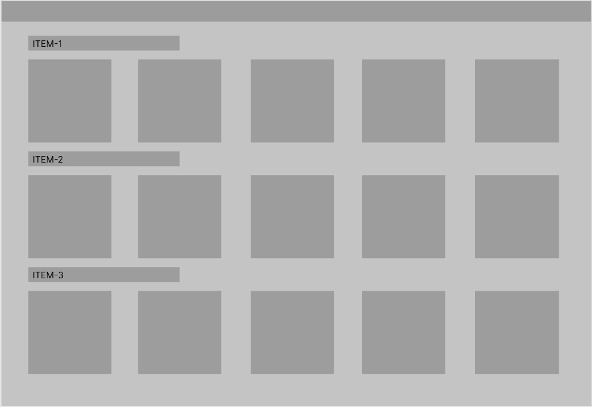

<h1>Food_Delivery_WebApp:</h1>

As the name suggest we are trying to build a food delivery webapp using reactjs.

This project should consists of these pages:

1==>Register page for new users.

2==>Login page for the existing ones.

3==>The home page (This page is to be made the most attractive and user friendly in a single scrollable page).

> If we select an item it should list all the restaurant selling this item and their price.

> If the user select any restaurant then it should give the menu of that restaurant with the specific tags(Starters,main course,deserts etc).

4==>The cart page (This page mainly consists of items that the user selected for order).

The students of ITER-SOAU are highly encouraged to contribute.

Anyone can raise issues and get assigned with the same by the mentors.

  
  
  
  
  
